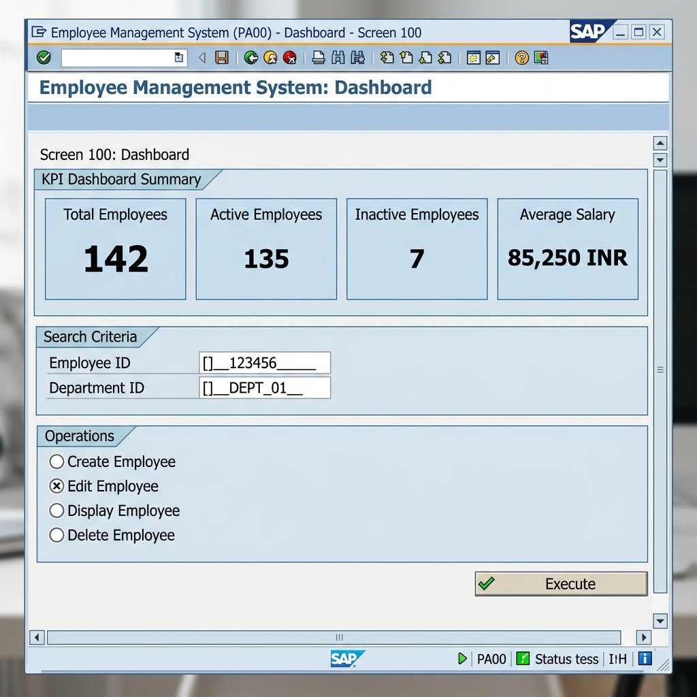
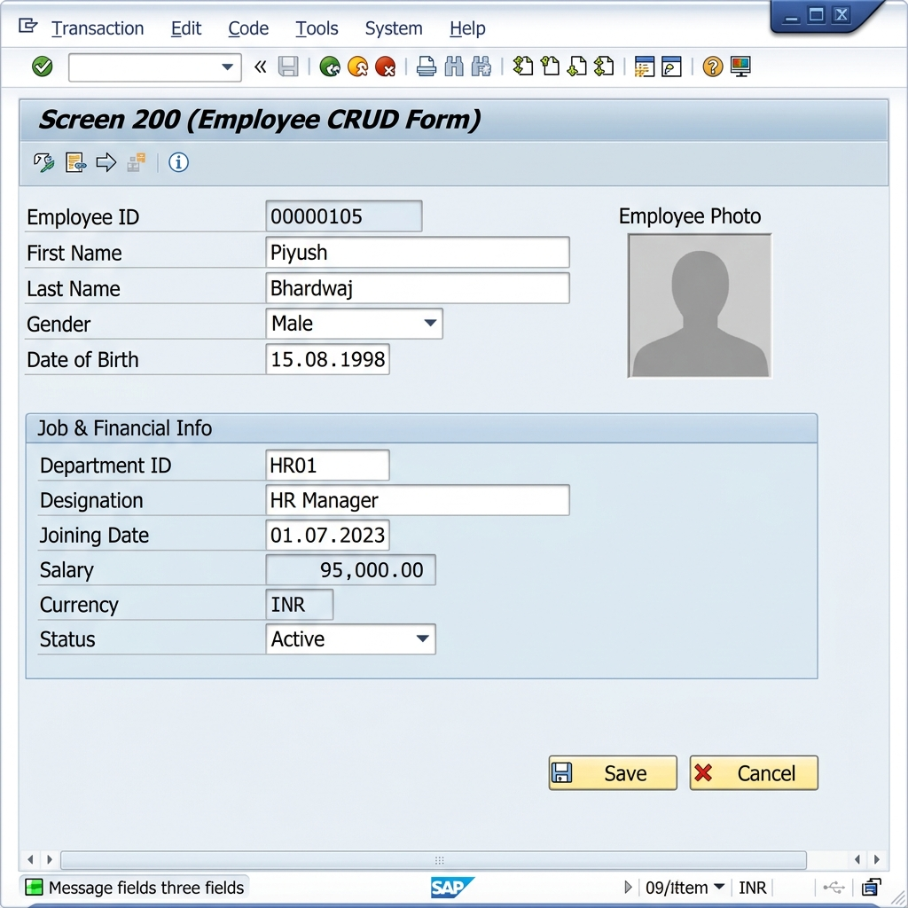
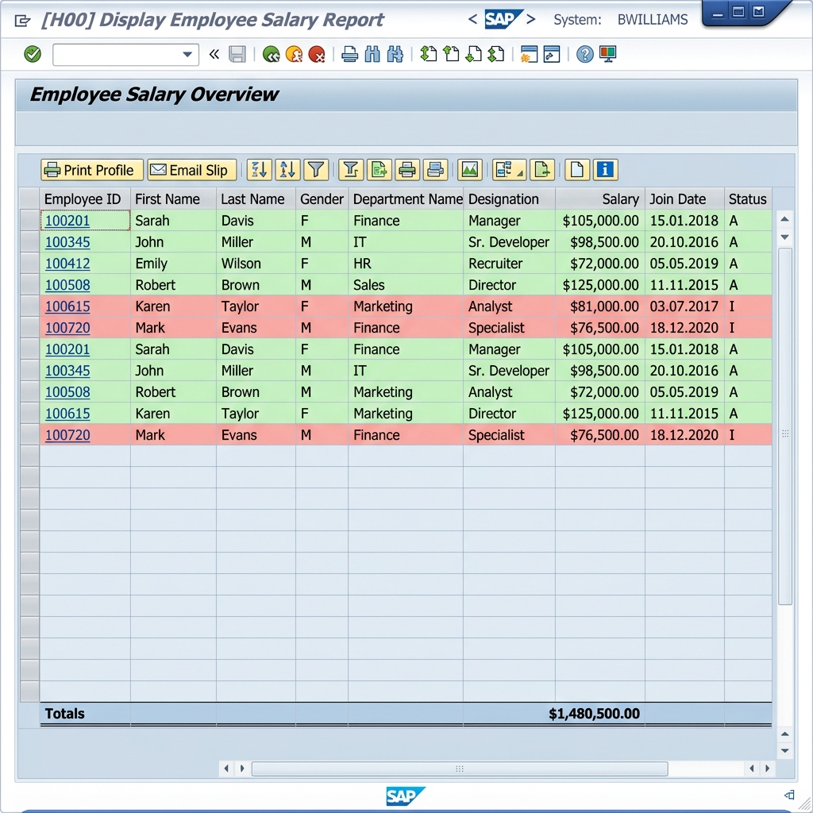
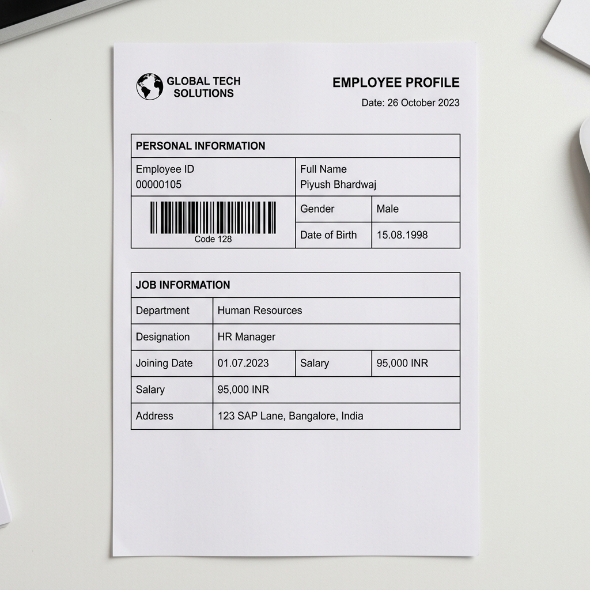
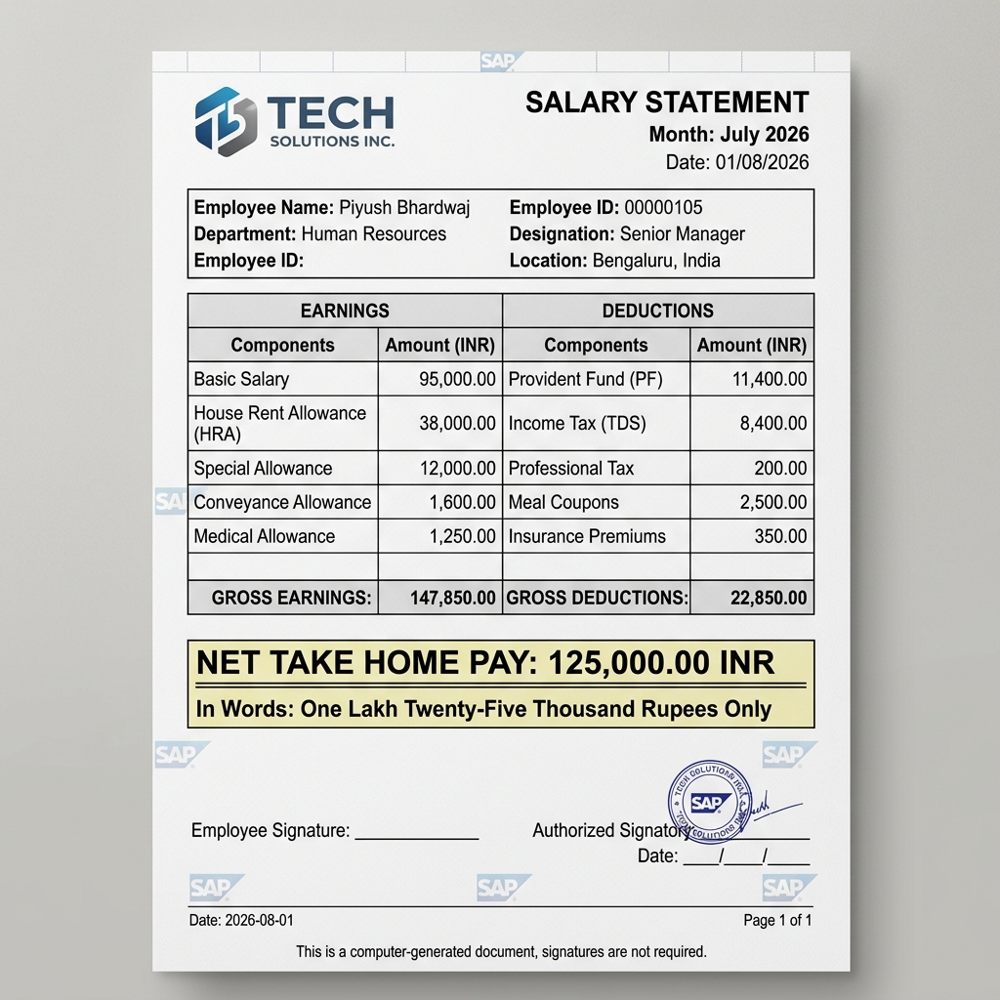

# SAP ABAP Employee Management System (EMS)

A comprehensive SAP ABAP Employee Management System built to demonstrate core SAP development concepts including Module Pool Programming, SAP Dictionary, OO ALV, Smart Forms, authorization checks, and Business Communication Services.

---

## 🏗️ System Architecture Flow

```text
       SAP GUI Presentation Layer
                   │
         Module Pool (PBO/PAI)
                   │
       Business Logic Class (OO ABAP)
                   │
               Open SQL
                   │
        SAP Data Dictionary (DDIC)
                   │
            Database Tables
```

---

## 📷 Application UI Mockups (Concept Layouts)

> [!NOTE]
> The screenshots below represent high-fidelity user interface layouts designed to mirror standard SAP GUI (Enjoy/Signature themes) and Smart Form PDF print structures. When you test and deploy the system on your active SAP NetWeaver application server, you can replace these placeholder templates with your live GUI screen snapshots.

### SAP GUI Screens
* **Dashboard (Screen 100)**: Features aggregate calculations (Total, Active, Inactive, Average Salary) and operations mapping.
  
  
* **Employee Data Entry Form (Screen 200)**: Demonstrates field locking logic, mandatory inputs verification, and a photobox container.
  
  
* **OO ALV Grid Report Dashboard**: Features interactive zebra stripes, cell hotspot links for drilldown navigation, and status-based row coloring (Green = Active, Red = Inactive).
  

### Smart Forms Printable Outputs
* **Employee Profile (A4 Portrait)**: Features company logo placeholder and Code 128 barcode format.
  
  
* **Employee ID Badge (Wallet Size)**: Optimized layout for PVC printing with a profile face placeholder and QR code generation.
  
  
* **Salary Statement Pay Slip**: Layout separating earnings and deductions, calculating net totals, and converting values to text representations.
  

---

## 🚀 Key Features

* **Dialog Programming (Module Pools)**: Custom multi-screen SAP GUI interface featuring:
  * **Screen 100 (Dashboard)**: Real-time Key Performance Indicators (KPIs) showing employee statistics, search filters, and navigation controls.
  * **Screen 200 (Employee Form)**: Dynamic CRUD interface with field locks, validation triggers, dropdowns, and check tables.
* **SAP Data Dictionary (DDIC)**: Clean database design using custom domains, data elements, transparent tables with foreign key constraints, search helps, and lock objects.
* **Table Maintenance View (SM30/TMG)**: Reusable Table Maintenance Generator (TMG) configuration with custom maintenance screens for the Department Master database.
* **Standard Number Range Objects (SNRO)**: Dynamic employee ID auto-generation using the standard `NUMBER_GET_NEXT` API instead of manual numeric increments.
* **Business Communication Services (BCS)**: Automated driver program that generates Smart Forms, converts OTF output to PDF, and emails it to employees via `CL_BCS`.
* **Standard Application Logging (SLG1)**: Integrated exception logging utilizing standard SAP APIs (`BAL_*`) to write system logs.
* **Audit Trail Tracking**: Custom audit table capturing change logs (Created/Updated/Deleted actions, date, time, and changing user `SY-UNAME`).
* **Enhanced OO ALV Reports**: Interactive grid reports using `CL_GUI_ALV_GRID` featuring:
  * Double-click hotspots for navigation (`CALL TRANSACTION`).
  * Zebra-striped records.
  * Cell color-coding based on active/inactive status.
  * Column totals and subtotals.
* **Smart Forms**: Printable, high-fidelity forms for **Employee Profiles** (with barcodes), **ID Cards** (with QR codes), and **Monthly Salary Slips**.
* **Role-Based Authorizations**: Enforcement of Admin (CRUD) and Viewer (Read-only) privileges via standard `AUTHORITY-CHECK` statements using a custom authorization object `Z_EMS_AUTH`.

---

## 📊 Project Metrics

Comprehensive modular SAP ABAP implementation including multiple DDIC objects, Module Pool screens, ALV reports, Smart Forms, and supporting documentation:
* **Custom Tables**: 4 (`ZEMS_T_EMPLOYEE`, `ZEMS_T_DEPT`, `ZEMS_T_AUDIT`, `ZEMS_T_LOG`)
* **Maintenance Views**: 1 (`ZEMS_V_DEPT` with TMG enabled)
* **Message Classes**: 1 (`ZEMS_MSG` in `SE91`)
* **DDIC Objects**: 15+ (Domains, Data Elements, Lock Objects, Search Helps)
* **SAP GUI Screens**: 2 layouts (Dashboard Screen 100, CRUD Form Screen 200)
* **Interactive ALV Reports**: 5 sub-reports managed via a single selection screen
* **Smart Forms**: 3 custom layouts
* **Modular Code Structure**: 1 Main Module Pool, 4 Includes, 1 Local OO ABAP Controller Class, and 25+ reusable subroutines

---

## 📂 Project Structure

```
├── ddic/                       # SAP Data Dictionary Objects
│   ├── domains_and_data_elements.abap
│   ├── zems_msg.abap           # Message Class ZEMS_MSG (SE91)
│   ├── zems_t_audit.abap       # Audit Log Table
│   ├── zems_t_dept.abap        # Department Master Table
│   ├── zems_t_employee.abap    # Employee Master Table
│   ├── zems_v_dept.abap        # Department Maintenance View
│   ├── lock_objects.abap       # Lock Objects (EZEMS_EMPLOYEE/DEPT)
│   └── search_helps.abap       # Search Helps (ZEMS_SH_EMP/DEPT)
│
├── src/                        # ABAP Source Code
│   ├── zems_employee_crud.abap # Main Module Pool Program (ZEMS_CRUD)
│   ├── zems_employee_top.abap  # TOP Include (Global Declarations)
│   ├── zems_employee_o01.abap  # PBO Include (Process Before Output)
│   ├── zems_employee_i01.abap  # PAI Include (Process After Input)
│   ├── zems_employee_lcl.abap  # OO ABAP Controller Class (Business Logic)
│   ├── zems_reports.abap        # OO ALV Grid Reports Program (ZEMS_REP)
│   └── screens_specification.md# Layout specifications for Screens 100 & 200
│
├── smartforms/                 # Smart Forms & Document Services
│   ├── smartforms_layout_spec.md
│   └── zems_smartforms_driver.abap # BCS Emailing & Form Print Driver
│
├── data/                       # Mock Data Seeding
│   └── zems_mock_data.abap     # Test Data Generator Program
│
├── docs/                       # Technical & Portfolio Documentation
│   ├── functional_specification.md
│   ├── technical_specification.md
│   ├── database_schema.md      # ERD & Schema Specs
│   ├── installation_guide.md   # Transport & Import Manual
│   ├── user_manual.md          # Application User Manual
│   ├── interview_qa.md         # 30+ SAP ABAP Interview Q&A
│   └── screenshots/            # Generated mockup screenshots
└── README.md                   # Project Overview & Landing Page
```

---

## 🛠️ Verification & Quality Assurance

Each component is written according to modern SAP coding standards:
1. **Dynamic Locks**: Utilizing standard lock enqueue and dequeue function modules to maintain transaction integrity.
2. **Modular Architecture**: All CRUD and processing logic is encapsulated in local ABAP classes, avoiding procedural code smell.
3. **Open SQL Optimization**: Selecting data into internal tables utilizing field symbols, skipping `SELECT *` where possible, and utilizing index-based keys.
4. **Validation Rules**: Strict checks on email regex formats, mobile string lengths, and date ranges.
5. **Secure Coding**: Utilizing `AUTHORITY-CHECK` statements on department scope and activity actions.
