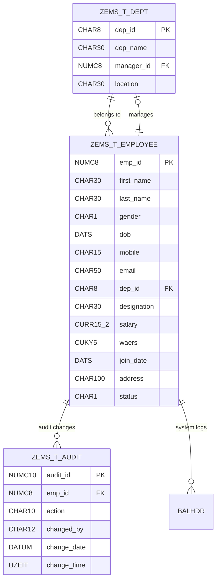

# Database Schema & ER Diagram

This document details the database schema, primary/foreign keys, and relational integrity rules for the Employee Management System (EMS).

---

## 1. Entity Relationship (ER) Diagram

---

## 2. Table-by-Table Schema Dictionary

### 2.1 Table: `ZEMS_T_EMPLOYEE` (Employee Master)

* **Primary Key**: `MANDT` + `EMP_ID`
* **Check Table**: `DEP_ID` -> checks against `ZEMS_T_DEPT-DEP_ID`
* **Search Help**: `ZEMS_SH_EMP`

| Field Name | Data Element | Data Type | Length | Decimal | Key | Description / Check Rules |
|------------|--------------|-----------|--------|---------|-----|---------------------------|
| `MANDT` | MANDT | CLNT | 3 | 0 | Y | Client ID (`SY-MANDT`) |
| `EMP_ID` | ZEMS_DE_EMPID | NUMC | 8 | 0 | Y | Employee ID (generated via `ZEMS_NR_EP`) |
| `FIRST_NAME` | ZEMS_DE_FNAME | CHAR | 30 | 0 | N | First Name |
| `LAST_NAME` | ZEMS_DE_LNAME | CHAR | 30 | 0 | N | Last Name |
| `GENDER` | ZEMS_DE_GENDER | CHAR | 1 | 0 | N | Gender (Fixed values: M, F, O) |
| `DOB` | ZEMS_DE_DOB | DATS | 8 | 0 | N | Date of Birth |
| `MOBILE` | ZEMS_DE_MOBILE | CHAR | 15 | 0 | N | Mobile Number (Regex validation) |
| `EMAIL` | ZEMS_DE_EMAIL | CHAR | 50 | 0 | N | Email Address (Regex validation) |
| `DEP_ID` | ZEMS_DE_DEPID | CHAR | 8 | 0 | N | Department Code (Check table: `ZEMS_T_DEPT`) |
| `DESIGNATION`| ZEMS_DE_DESIG | CHAR | 30 | 0 | N | Job Designation |
| `SALARY` | ZEMS_DE_SALARY | CURR | 15 | 2 | N | Base Salary (Ref: `WAERS`, must be > 0) |
| `WAERS` | WAERS | CUKY | 5 | 0 | N | Currency Key (Default: 'INR') |
| `JOIN_DATE` | ZEMS_DE_JOINDATE| DATS | 8 | 0 | N | Joining Date (<= `SY-DATUM`) |
| `ADDRESS` | ZEMS_DE_ADDRESS | CHAR | 100| 0 | N | Residential Address |
| `STATUS` | ZEMS_DE_STATUS | CHAR | 1 | 0 | N | Status (Fixed values: A - Active, I - Inactive) |

---

### 2.2 Table: `ZEMS_T_DEPT` (Department Master)

* **Primary Key**: `MANDT` + `DEP_ID`
* **Check Table**: `MANAGER_ID` -> checks against `ZEMS_T_EMPLOYEE-EMP_ID`
* **Search Help**: `ZEMS_SH_DEPT`
* **Buffering**: Allowed, Fully Buffered (Read-Heavy, Write-Rare)

| Field Name | Data Element | Data Type | Length | Decimal | Key | Description / Check Rules |
|------------|--------------|-----------|--------|---------|-----|---------------------------|
| `MANDT` | MANDT | CLNT | 3 | 0 | Y | Client ID (`SY-MANDT`) |
| `DEP_ID` | ZEMS_DE_DEPID | CHAR | 8 | 0 | Y | Department Code |
| `DEP_NAME` | ZEMS_DE_DEPNAME | CHAR | 30 | 0 | N | Department Name |
| `MANAGER_ID` | ZEMS_DE_EMPID | CHAR | 8 | 0 | N | Manager Employee ID |
| `LOCATION` | ZEMS_DE_LOCATION| CHAR | 30 | 0 | N | Department Location |

---

### 2.3 Table: `ZEMS_T_AUDIT` (Audit Trail Log)

* **Primary Key**: `MANDT` + `AUDIT_ID`
* **Check Table**: `EMP_ID` -> checks against `ZEMS_T_EMPLOYEE-EMP_ID`

| Field Name | Data Element | Data Type | Length | Decimal | Key | Description / Check Rules |
|------------|--------------|-----------|--------|---------|-----|---------------------------|
| `MANDT` | MANDT | CLNT | 3 | 0 | Y | Client ID |
| `AUDIT_ID` | ZEMS_DE_AUDITID | NUMC | 10 | 0 | Y | Sequence Key (generated via `ZEMS_NR_AD`) |
| `EMP_ID` | ZEMS_DE_EMPID | NUMC | 8 | 0 | N | Affected Employee ID |
| `ACTION` | ZEMS_DE_ACTION | CHAR | 10 | 0 | N | CRUD Action (CREATE, UPDATE, DELETE) |
| `CHANGED_BY` | UNAME | CHAR | 12 | 0 | N | Changing User (`SY-UNAME`) |
| `CHANGE_DATE`| DATUM | DATS | 8 | 0 | N | Date of action (`SY-DATUM`) |
| `CHANGE_TIME`| UZEIT | TIMS | 6 | 0 | N | Time of action (`SY-UZEIT`) |

---

## 3. Relational Integrity & Cascades
1. **Foreign Key check**: `ZEMS_T_EMPLOYEE-DEP_ID` is bound to check table `ZEMS_T_DEPT`. If a department is deleted, any employee assigned to that department will raise verification warnings.
2. **Manager assignment integrity**: `ZEMS_T_DEPT-MANAGER_ID` references `ZEMS_T_EMPLOYEE-EMP_ID`. An employee must be hired before they can be assigned as a manager of a department.
3. **Audit trailing integrity**: The audit table holds references to the employee ID (`EMP_ID`). If an employee is deleted, the log preserves historical references by saving action `DELETE` alongside the timestamp and terminating user's username.
