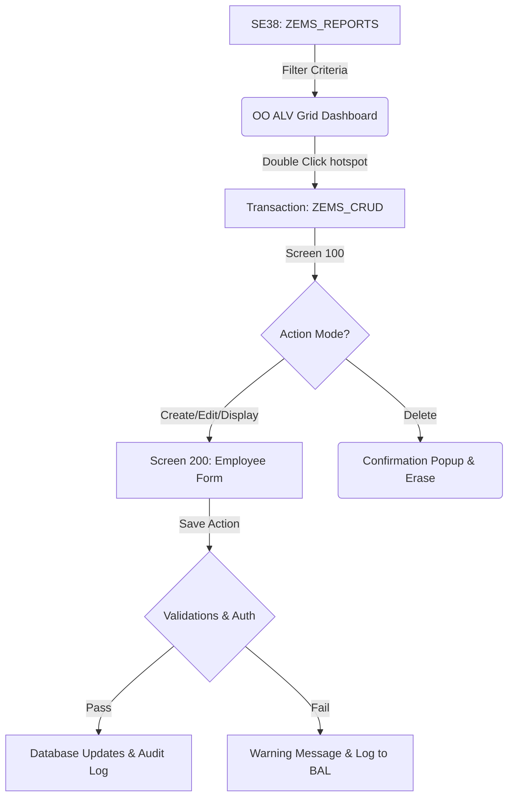

# Functional Specification: Employee Management System (EMS)

## 1. Project Overview & Business Value

### 1.1 Objective
The Employee Management System (EMS) is a centralized SAP-based application designed to manage employee lifecycle records, salary statistics, and department allocations. It provides the HR department with an intuitive dashboard to perform CRUD (Create, Read, Update, Delete) transactions, run analytical grid reports, and generate printable documents (Profiles, ID Cards, and Pay Slips) while maintaining data integrity and audit compliance.

### 1.2 Target Audience
* **HR Administrators (Admin)**: Full system access for hiring, updating, and terminating employee profiles.
* **Line Managers / Executive Viewers (Viewer)**: Read-only access to view employee metadata and run statistical reports for budgeting and planning.

---

## 2. System Architecture & Use Cases

### 2.1 Use Case 1: Employee Hiring (Create Record)
* **Actor**: HR Admin
* **Description**: HR Admin enters the EMS CRUD dashboard, clicks "Create Employee", and fills in details on Screen 200.
* **Pre-conditions**: Department must exist in check table `ZEMS_T_DEPT`.
* **Post-conditions**: System generates a unique Employee ID via number range `ZEMS_NR_EP`, saves the record, writes an entry to audit table `ZEMS_T_AUDIT`, and increments the dashboard counters.

### 2.2 Use Case 2: Employee Maintenance (Update/Display Record)
* **Actor**: HR Admin / Line Manager
* **Description**: User searches for an Employee ID.
  * If HR Admin (Edit Mode): Fields are editable. Changes are validated and saved.
  * If Line Manager (Display Mode): All data entry fields are locked (read-only).
* **Validation Rules**:
  * Mandatory checks: First Name, Last Name, DOB, Gender, Status, Join Date.
  * Age check: Employee must be >= 18 years old.
  * Email syntax check: Matches standard regex format.
  * Mobile format: Valid numeric length.
  * Salary: Positive currency value.

### 2.3 Use Case 3: Employee Termination (Delete Record)
* **Actor**: HR Admin
* **Description**: HR Admin selects "Delete Employee" and enters the ID.
* **Process**: System prompts a validation confirmation dialog. Upon approval, it locks the record, deletes it from `ZEMS_T_EMPLOYEE`, and writes a "DELETE" action log to `ZEMS_T_AUDIT`.

### 2.4 Use Case 4: Statistical Reporting (ALV Dashboard)
* **Actor**: HR Admin / Line Manager
* **Description**: User opens reports screen, selects filters (Dept, Join Date, Salary limit), and selects a report type.
* **Output**: Displays interactive ALV grid with zebra patterns, active status color-coding, and salary summary totals. Double-clicking Employee ID opens their details in Screen 200.

### 2.5 Use Case 5: Pay Slip & Profile Delivery (Smart Forms & BCS)
* **Actor**: HR Admin
* **Description**: HR Admin selects employees in the ALV report and clicks "Print Profile" or "Email Slip".
* **Process**:
  * Print Profile: Launches spool dialogue with print preview.
  * Email Slip: Smart Form OTF output converts to PDF, attaches to an email container, and routes via BCS to the employee email address.
