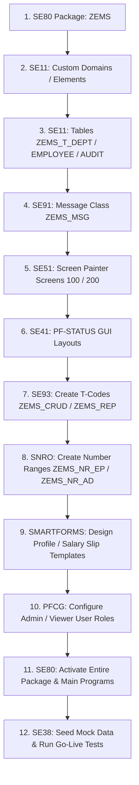

# Installation & Configuration Guide

This guide details how to import and configure the Employee Management System (EMS) objects in a standard SAP Application Server. All objects should be assigned to custom package **`ZEMS`** under an active Transport Request.

---

## 🏗️ Deployment Flow Diagram

---

## Step 1: Package Creation (`SE80` / `SE21`)
1. Open Transaction `SE20` or `SE80`.
2. Create a new Package named `ZEMS`.
3. Select Software Component: `HOME` or `LOCAL` (if local, otherwise match system landscape).
4. Save to a new Workbench Transport Request.

---

## Step 2: Custom Domains & Data Elements (`SE11`)
Create custom data dictionary elements as specified in [domains_and_data_elements.abap](file:///D:/Project/Employee%20Management%20System%20SAP/ddic/domains_and_data_elements.abap):
1. Navigate to Transaction `SE11`.
2. Define Domains first (`ZEMS_D_EMPID`, `ZEMS_D_GENDER`, etc.), set fixed values for status/gender, and activate.
3. Define Data Elements, reference the domains, add Field Labels (Short, Medium, Long, Heading), and activate.

---

## Step 3: Transparent Tables & Maintenance Views (`SE11` / `SE13` / `SE54`)
1. Create Transparent Tables: `ZEMS_T_DEPT`, `ZEMS_T_EMPLOYEE`, and `ZEMS_T_AUDIT` using fields defined in `ddic/` folder.
2. In Technical Settings (`SE13`):
   * Set Data Class to `APPL0` for Master Data, `APPL1` for Transaction logs.
   * Enable Log Data Changes for `ZEMS_T_EMPLOYEE` and `ZEMS_T_DEPT` (checked).
   * Enable Full Buffering for table `ZEMS_T_DEPT`.
3. Define check table links:
   * Map `ZEMS_T_EMPLOYEE-DEP_ID` to check table `ZEMS_T_DEPT-DEP_ID`.
4. Create Maintenance View `ZEMS_V_DEPT` in `SE11`.
5. Under `Utilities -> Table Maintenance Generator` for `ZEMS_V_DEPT`:
   * Authorization Group: `&NC&`
   * Function Group: `ZEMS_FG_DEPT`
   * Maintenance Type: `One-step`
   * Screen Number: `0001`
   * Click **Create** to compile the SM30 screens.

---

## Step 4: Lock Objects & Search Helps (`SE11`)
1. Create lock objects `EZEMS_EMPLOYEE` on `ZEMS_T_EMPLOYEE` and `EZEMS_DEPT` on `ZEMS_T_DEPT`. Set lock mode to **Exclusive lock (Write lock / E)**.
2. Create Search Help `ZEMS_SH_DEPT` and `ZEMS_SH_EMP`. Map importing/exporting parameters.
3. Assign search helps to their fields in transparent tables.

---

## Step 5: Number Range Objects (`SNRO`)
Define two number range intervals:
1. Open Transaction `SNRO`.
2. Create Object: `ZEMS_NR_EP` (Employee Number Range)
   * Domain: `ZEMS_D_EMPID`
   * Warning %: `10`
   * Click Save. Go to `Number Ranges -> Intervals` and add:
     * No: `01` | From: `00000001` | To: `99999999`
3. Create Object: `ZEMS_NR_AD` (Audit Logs Number Range)
   * Domain: `ZEMS_D_AUDITID`
   * Add Interval No: `01` | From: `0000000001` | To: `9999999999`

---

## Step 6: Custom Message Class (`SE91`)
1. Open Transaction `SE91`.
2. Create Message Class: `ZEMS_MSG`.
3. Add the message texts defined in [zems_msg.abap](file:///D:/Project/Employee%20Management%20System%20SAP/ddic/zems_msg.abap) (numbers 000 through 023). Save.

---

## Step 7: Dialog & Report Programs (`SE80` / `SE38`)
1. Create Dialog Program `ZEMS_EMPLOYEE_CRUD` (type Module Pool) in `SE80` and add includes: `zems_employee_top`, `zems_employee_lcl`, `zems_employee_o01`, `zems_employee_i01`.
2. Create Screen `100` and Screen `200` using the Screen Painter layout definitions. Assign element names and screen group `EDT`.
3. Create Transaction Code: `ZEMS_CRUD` (using SE93 -> Program and Screen, Screen 100).
4. Create Executable Report `ZEMS_REPORTS` in `SE38`. Copy-paste code from `src/zems_reports.abap`.
5. Create Screen `9000` (ALV wrapper) inside report `ZEMS_REPORTS`.
6. Create Transaction Code: `ZEMS_REP` referencing report `ZEMS_REPORTS`.

---

## Step 8: Smart Forms (`SMARTFORMS`)
1. Open Transaction `SMARTFORMS`.
2. Define forms `ZEMS_SF_PROFILE` and `ZEMS_SF_SALSLIP` according to blueprints.
3. Import Company Logo graphic inside transaction `SE78` (Graphic administration) as a BMP image.
4. Reference the graphic node inside the form layout.

---

## Step 9: Roles & Authorizations (`PFCG` / `SU21`)
1. Create Custom Authorization Fields in `SU21` (if not pre-existing):
   * Field: `DEP_ID` (Length: 8, Type: CHAR)
   * Field: `ACTVT` (Length: 2, Type: CHAR, references standard Activity field)
2. Define custom Authorization Object `Z_EMS_AUTH` under object class `HR` (Human Resources):
   * Add fields: `ACTVT` and `DEP_ID`.
3. Open Transaction `PFCG` (Role Maintenance):
   * Create Role: `ZEMS_ADMIN`
     * Menu tab: Add T-Codes `ZEMS_CRUD`, `ZEMS_REP`, `SM30`.
     * Authorizations tab: Click **Change Authorization Data**, insert object `Z_EMS_AUTH`.
     * Configure Values: `ACTVT` = `01` (Create), `02` (Change), `03` (Display), `06` (Delete); `DEP_ID` = `*` (All Departments).
     * Click **Generate** to compile the profile.
   * Create Role: `ZEMS_VIEWER`
     * Menu tab: Add T-Code `ZEMS_REP`.
     * Authorizations tab: Insert object `Z_EMS_AUTH`.
     * Configure Values: `ACTVT` = `03` (Display); `DEP_ID` = `*`.
     * Click **Generate**.
4. Assign roles to active users in `SU01` (User Maintenance).

---

## 📦 Transport Management & Buffering Configuration

### 1. Transport Requests (TR) Sequence
When moving EMS between system landscapes (DEV -> QA -> PROD), release and import transport requests in this order:
1. **Workbench Request**: Holds all repository objects (Tables, Domains, Data Elements, Programs, Screens, Smart Forms, Lock Objects).
2. **Customizing Request**: Holds role menu bindings, transaction code assignments, and Table Maintenance TMG configurations.
*Note: Number Range intervals (`SNRO`) are client-dependent and must be manually maintained in target clients or moved via dedicated customizing transports.*

### 2. Number Range Buffering Settings (`SNRO`)
In transaction `SNRO` for object `ZEMS_NR_EP`, set the buffering options under `Edit -> Change`:
* **Number of Numbers in Buffer**: `10`
* **Buffer Strategy**: Main Memory Buffering (Recommended for high-frequency CRUD transactions to minimize DB lookup overhead. If strict gapless tracking is required by auditing, select No Buffering).

---

## Step 10: Troubleshooting & Validation Transactions
During testing and transport import verification on a live ABAP system, utilize the following administrative transactions:
* **`ST22` (ABAP Runtime Errors)**: Analyze system dumps or trace unexpected runtime failures.
* **`SU53` (Authorization Failure Analysis)**: If user actions fail or block access, execute `/nSU53` immediately to identify missing permissions for custom authorization object `Z_EMS_AUTH` or activity `ACTVT`.
* **`SLG1` (Application Log Viewer)**: Enter Object `ZEMS_LOG` and Subobject `CRUD` to view system warnings and transaction logs written by the controller class.
* **`SM12` (Lock Entry Display)**: Monitor locked rows during testing to ensure lock objects `EZEMS_EMPLOYEE` and `EZEMS_DEPT` are correctly locking and unlocking records.

